# Custom AI Variants

Documentation of all the custom AI variants used for the Warzone mode. Only the modified and necessary info about each AI is shown. Any data values not listed are assumed to be defaults for that AI unit. All AI are set to Legendary difficulty with dynamic co-op scale at One Player.

<!--
## [#] AI Name
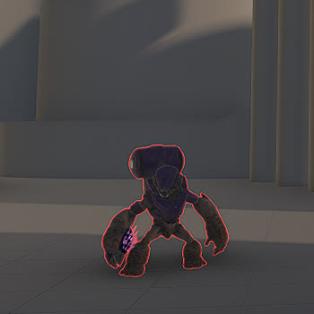
- Primary Weapon Type: #
- Secondary Weapon Type: #
- Grenade Type: # Grenade
- Trait Set: ?
  - Weapon Damage: #.##
  - Damage Resistance
    - Direct Damage Scalar: #.##
    - Grenade Damage Scalar: #.##
    - Explosive Damage Scalar: #.##
- Notes: -
-->

## [1] Grunt Conscript, Yellow

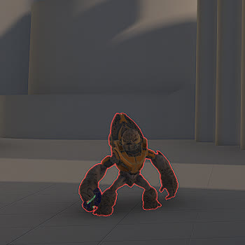
- Primary Weapon Type: Mk50 Sidekick
- Secondary Weapon Type: -
- Trait Set: GruntConscriptYellow
- Notes: -

## [2] Grunt Ultra

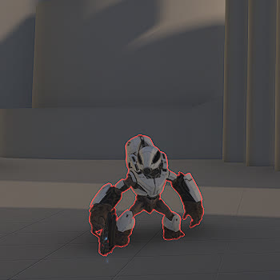
- Primary Weapon Type: Mangler + Arcane Sentinel Beam ([38] Infiltrator Off Worlds)
- Secondary Weapon Type: -
- Trait Set: GruntUltra
  - Weapon Damage: 0.01
  - Damage Resistance
    - Direct Damage Scalar: 3.80
    - Grenade Damage Scalar: 0.83
    - Explosive Damage Scalar: 0.83
- Notes: Fires Banished Hunter shots from the weapon. Drops a [[38] Infiltrator Off Worlds](../items/weapon-configs.md#38-infiltrator-off-worlds) upon death and deletes the Mangler + Arcane Sentinel Beam.

## [3] Boss Bipbap

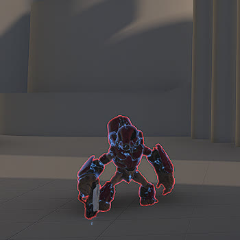
- Primary Weapon Type: Plasma Pistol + Arcane Sentinel Beam ([14] Hardlight Plasma Pistol)
- Secondary Weapon Type: -
- Trait Set: BossBipbap
  - Weapon Damage: 1.90
- Notes: Is a Boss and has a health bar.

## [4] Jackal Freebooter

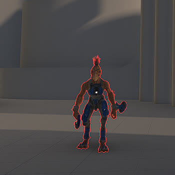
- Primary Weapon Type: Plasma Pistol
- Secondary Weapon Type: -
- Trait Set: JackalFreebooter
- Notes: -

## [5] Jackal Raider

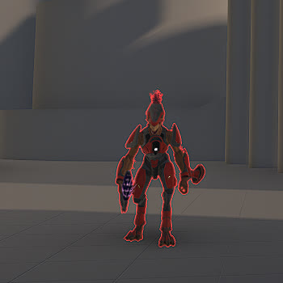
- Primary Weapon Type: Needler
- Secondary Weapon Type: -
- Trait Set: JackalRaider
- Notes: -

## [6] Boss Adjutant Resolution, Gold

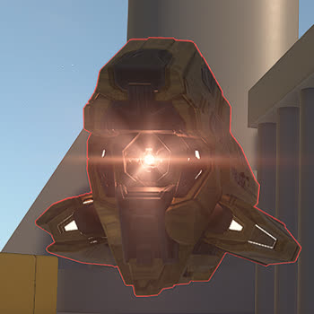
- Primary Weapon Type: Gold Sentry Primary (Scrap Cannon variant)
- Secondary Weapon Type: Gold Sentry Secondary (M41 SPNKr variant)
- Trait Set: BossAdjutantResolutionGold
  - Weapon Damage: 3.00
  - Damage Resistance
    - Direct Damage Scalar: 1.50
    - Grenade Damage Scalar: 0.666
    - Explosive Damage Scalar: 0.666
- Notes: -

## [7] Marine Assault

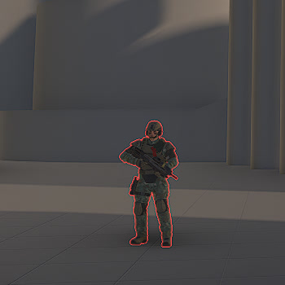
- Primary Weapon Type: MA40 Assault Rifle
- Secondary Weapon Type: -
- Trait Set: MarineAssault
  - Weapon Damage: 3.50
  - Damage Resistance
    - Direct Damage Scalar: 0.20
    - Grenade Damage Scalar: 5.00
    - Explosive Damage Scalar: 5.00
- Notes: -

## [8] Elite Mercenary

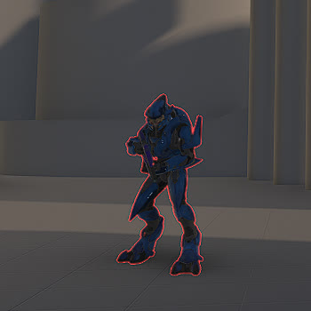
- Primary Weapon Type: Pulse Carbine
- Secondary Weapon Type: -
- Trait Set: EliteMercenary
  - Damage Resistance
    - Direct Damage Scalar: 1.20
    - Grenade Damage Scalar: 1.69
    - Explosive Damage Scalar: 1.69
- Notes: Will die in 3 Hydra direct rockets and 1 Rocket Launcher Rocket

## [9] Elite Warlord

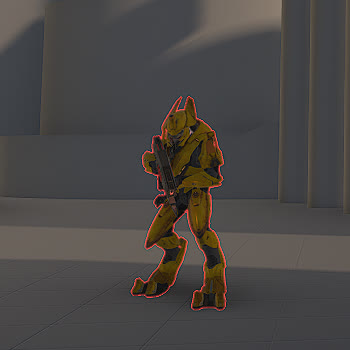
- Primary Weapon Type: Stalker Rifle
- Secondary Weapon Type: - (delete)
- Trait Set: EliteWarlord
  - Damage Resistance
    - Direct Damage Scalar: 2.00
    - Grenade Damage Scalar: 1.30
    - Explosive Damage Scalar: 1.30
- Notes: Will die in 4 direct M41 SPNKr rockets.

## [10] Elite Ultra

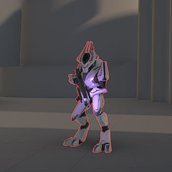
- Primary Weapon Type: Rapidfire Pulse Carbine
- Secondary Weapon Type: Energy Sword
- Trait Set: EliteUltra
  - Damage Resistance
    - Direct Damage Scalar: 1.00
    - Grenade Damage Scalar: 1.84
    - Explosive Damage Scalar: 1.84
- Notes: Will die in 4 Hydra direct rockets and 2 Rocket Launcher Rockets. Drives a Ghost in [[8] Hunter Encounter, Mythic](../items/../npc/encounter-configs.md#8-hunter-encounter-mythic)

## [11] Boss Ordo 'Mal

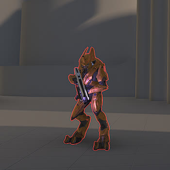
- Primary Weapon Type: Scatterbound Heatwave
- Secondary Weapon Type: - (delete)
- Trait Set: BossOrdoMal
- Notes: Is a Boss and has a health bar.

## [12] Boss Thav 'Sebarim

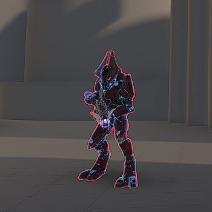
- Primary Weapon Type: Cindershot + Arcane Sentinel Beam ([37] Spike Off Thav 'Sebarim)
- Secondary Weapon Type: -
- Trait Set: BossThavSebarim
  - Weapon Damage: 1.30
  - Damage Resistance
    - Direct Damage Scalar: 1.30
    - Grenade Damage Scalar: 0.7692
    - Explosive Damage Scalar: 0.7692
- Notes: Fires Spike Grenade projectiles. Is a Boss and has a health bar. Drops a [[37] Spike Off Thav 'Sebarim](https://github.com/The-Scripters-Guild/Warzone/blob/main/docs/items/weapon-configs.md#37-spike-off-thav-sebarim) upon death and deletes the Cindershot + Arcane Sentinel Beam.

## [13] Hunter

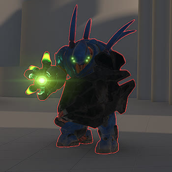
- Primary Weapon Type: Hunter Primary
- Secondary Weapon Type: Hunter Secondary
- Trait Set: Hunter
  - Weapon Damage: 0.70
  - Damage Resistance
    - Direct Damage Scalar: 0.40
    - Grenade Damage Scalar: 4.00
    - Explosive Damage Scalar: 0.70
- Notes: Is a Boss and has a health bar. 2 direct M41 SPNkrs in the front or 1 in the back will kill. 2 well-placed Frag Grenades will kill.

## [14] Boss Myriad

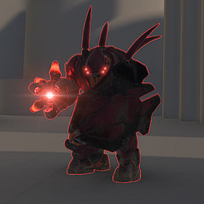
- Primary Weapon Type: Banished Hunter Primary
- Secondary Weapon Type: Banished Hunter Secondary
- Trait Set: BossMyriad
  - Weapon Damage: 1.30
  - Damage Resistance
    - Direct Damage Scalar: 2.00
    - Grenade Damage Scalar: 0.50
    - Explosive Damage Scalar: 0.50
- Notes: Is a Boss and has a health bar.

## [15] Brute Minor

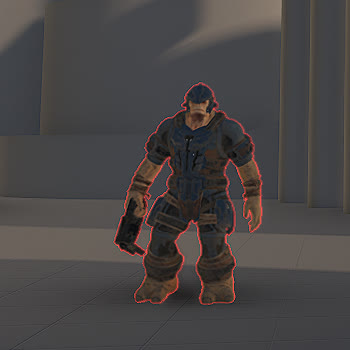
- Primary Weapon Type: MA40 Longshot
- Secondary Weapon Type: - (delete)
- Trait Set: BruteMinor
  - Damage Resistance
    - Direct Damage Scalar: 4.30
    - Grenade Damage Scalar: 2.57
    - Explosive Damage Scalar: 2.57
- Notes: Will die in 3 Hydra direct rockets and 1 Rocket Launcher Rocket.

## [16] Brute Berserker, Chosen

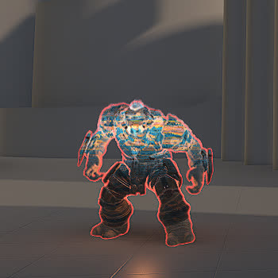
- Primary Weapon Type: Brute Fists
- Secondary Weapon Type: -
- Trait Set: BruteBerserkerChosen
  - Weapon Damage: 1.50
  - Damage Resistance
    - Direct Damage Scalar: 4.30
    - Grenade Damage Scalar: 0.2325
    - Explosive Damage Scalar: 0.2325
- Notes: Is a Boss and has a health bar. Moves very fast and can two-hit melee a Spartan.

## [17] Brute Warrior

- Primary Weapon Type: VK78 Commando Rifle
- Secondary Weapon Type: -
- Trait Set: BruteWarrior
  - Damage Resistance
    - Direct Damage Scalar: 4.30
    - Grenade Damage Scalar: 2.57
    - Explosive Damage Scalar: 2.57
- Notes: Will die in 4 Hydra direct rockets and 2 Rocket Launcher Rockets. Drives a Wraith in [[6] Brute 1 Encounter, Legendary](../items/../npc/encounter-configs.md#6-brute-1-encounter-legendary)

## [18] Brute Chieftain Turret

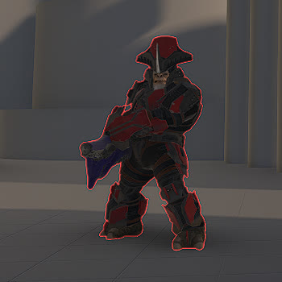
- Primary Weapon Type: Brute Plasma Cannon (Plasma Cannon variant)
- Secondary Weapon Type: -
- Trait Set: BruteChieftainTurret
  - Damage Resistance
    - Direct Damage Scalar: 2.00
    - Grenade Damage Scalar: 1.60
    - Explosive Damage Scalar: 1.60
- Notes: Will die in 4 direct M41 SPNKr rockets.

## [19] Brute Warlord

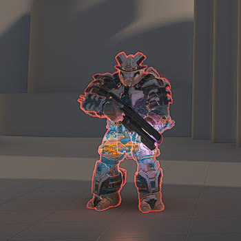
- Primary Weapon Type: Ravager Rebound
- Secondary Weapon Type: -
- Trait Set: BruteWarlord
  - Damage Resistance
    - Direct Damage Scalar: 3.80
    - Grenade Damage Scalar: 2.10
    - Explosive Damage Scalar: 2.10
- Notes: Will die in 4 direct M41 SPNKr rockets.

## [20] Brute Chieftain

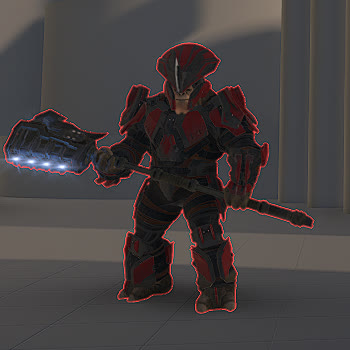
- Primary Weapon Type: - (delete)
- Primary Weapon Type: -
- Trait Set: BruteChieftain
  - Damage Resistance
    - Direct Damage Scalar: 0.60
    - Grenade Damage Scalar: 1.6666
    - Explosive Damage Scalar: 1.6666
- Notes: Has no weapon, but the vehicle EMP effect from the melee still stays. This AI is used to punish players who try to splatter the encounter's boss with a vehicle.

## [21] Boss Arthoc

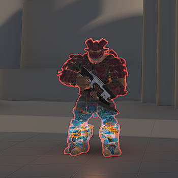
- Primary Weapon Type: Ravager
- Secondary Weapon Type: -
- Trait Set: BossArthoc
- Notes: Is a Boss and has a health bar.

## [22] Hunter, Banished

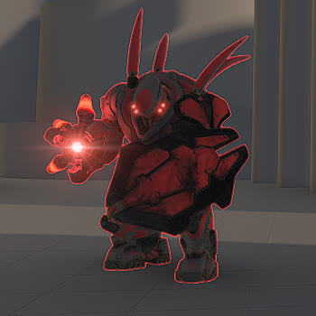
- Primary Weapon Type: Banished Hunter Primary
- Secondary Weapon Type: Banished Hunter Secondary
- Trait Set: HunterBanished
  - Damage Resistance
    - Direct Damage Scalar: 0.80
    - Grenade Damage Scalar: 2.00
    - Explosive Damage Scalar: 1.00
- Notes: Is a Boss and has a health bar.

## [23] Boss Escharum

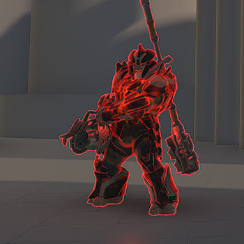
- Primary Weapon Type: Brute Scrap Cannon (Scrap Cannon variant)
- Secondary Weapon Type: Diminisher of Hope
- Trait Set: BossEscharum
- Notes: Is a Boss and has a health bar.

## [24] Boss Harbinger

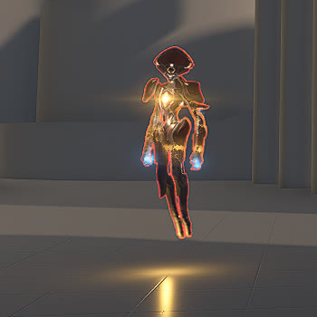
- Primary Weapon Type: Harbinger Primary (Unique)
- Secondary Weapon Type: -
- Trait Set: BossHarbinger
  - Weapon Damage: 1.40
  - Damage Resistance
    - Direct Damage Scalar: 2.00
    - Grenade Damage Scalar: 0.50
    - Explosive Damage Scalar: 0.50
- Notes: Is a Boss and has a health bar. Teleports around during combat. Has four stages of dealing damage to their shield, and then their health, before dying.

## [25] Boss Chak 'Lok

- Primary Weapon Type: MLRS-2 Hydra + Unbound Plasma Pistol ([48] Headhunter)
- Secondary Weapon Type: Elite Bloodblade
- Grenade Type: Plasma Grenade
- Trait Set: BossChakLok
  - Weapon Damage: 1.20
  - Damage Resistance
    - Direct Damage Scalar: 2.50
    - Grenade Damage Scalar: 0.40
    - Explosive Damage Scalar: 0.40
- Notes: Is a Boss and has a health bar. Activates shield only after engaging a target. Has an Active Camouflage equipment that they may use during an engagement.

## [26] Boss Hyperius

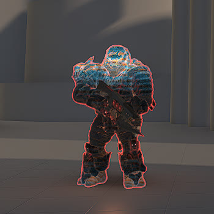
- Primary Weapon Type: CQS48 Bulldog + Diminisher of Hope ([12] Valor Off Dinh)
- Secondary Weapon Type: -
- Grenade Type: Spike Grenade
- Trait Set: BossHyperius
  - Weapon Damage: 3.00
  - Damage Resistance
    - Direct Damage Scalar: 2.00
    - Grenade Damage Scalar: 2.00
    - Explosive Damage Scalar: 5.00
- Notes: Is a Boss and has a health bar. Has armor pieces that can be shot off to deal more damage to the unarmored areas. Has a jetpack that they can use to jump any length or height nav jump hint. Weak to explosive damage.
