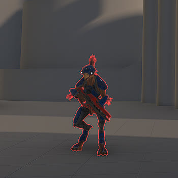
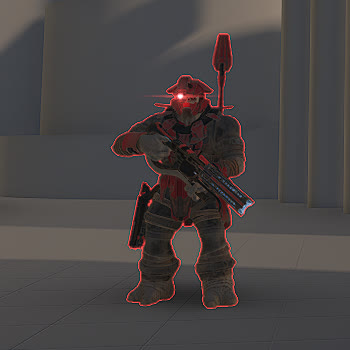
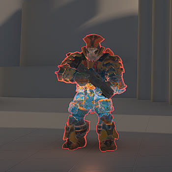

# Custom AI Variants

Documentation of all the custom AI variants used for the Warzone mode. Only the modified and necessary info about each AI is shown. Any data values not listed are assumed to be defaults for that AI unit. All AI are set to Legendary difficulty with dynamic co-op scale at One Player.

<!--
## [#] AI Name

* Primary Weapon Type: #
* Secondary Weapon Type: #
* Grenade Type: # Grenade
* Trait Set: ?
  * Weapon Damage: #.##
  * Damage Resistance
    * Direct Damage Scalar: #.##
    * Grenade Damage Scalar: #.##
    * Explosive Damage Scalar: #.##
* Notes: -
-->

## [4] Grunt Conscript, Yellow

* Primary Weapon Type: Mk50 Sidekick
* Trait Set: -
* Notes: -

## [5] Grunt Ultra

* Primary Weapon Type: Mangler + Arcane Sentinel Beam
* Trait Set: ?
  * Weapon Damage: Same as [[38] Infiltrator Off Worlds](../items/weapon-configs.md#38-infiltrator-off-worlds) including projectile-related values
  * Damage Resistance
    * Direct Damage Scalar: 3.80
    * Grenade Damage Scalar: 0.83
    * Explosive Damage Scalar: 0.83
* Notes: Will die in 4 Hydra direct rockets and 2 Rocket Launcher Rockets. Drops a [[38] Infiltrator Off Worlds](../items/weapon-configs.md#38-infiltrator-off-worlds) upon death and deletes the Mangler + Arcane Sentinel Beam.

## [6] Boss Bipbap

* Primary Weapon Type: Disruptor
* Trait Set: -
* Notes: Is a Boss and has a health bar.

## [8] Jackal Freebooter

* Trait Set: -
* Notes: -

## [9] Jackal Raider

* Trait Set: -
* Notes: -

## [11] Jackal Sniper

* Trait Set: ?
  * Weapon Damage: 1.30
* Notes: -

## [18] Marine Assault

* Trait Set: ?
  * Weapon Damage: 3.50
  * Damage Resistance
    * Direct Damage Scalar: 0.30
    * Grenade Damage Scalar: 3.3333
    * Explosive Damage Scalar: 3.3333
* Notes: -

## [25] Elite Mercenary

* Trait Set: ?
  * Damage Resistance
    * Direct Damage Scalar: 1.20
    * Grenade Damage Scalar: 1.69
    * Explosive Damage Scalar: 1.69
* Notes: Will die in 3 Hydra direct rockets and 1 Rocket Launcher Rocket

## [27] Elite Warlord

* Primary Weapon Type: Rapidfire Pulse Carbine
* Secondary Weapon Type: None
* Trait Set: -
  * Damage Resistance
    * Direct Damage Scalar: 2.00
    * Grenade Damage Scalar: 0.50
    * Explosive Damage Scalar: 0.50
* Notes: -

## [28] Elite Ultra

* Primary Weapon Type: Stalker Rifle Ultra
* Trait Set: -
  * Damage Resistance
    * Direct Damage Scalar: 1.00
    * Grenade Damage Scalar: 1.84
    * Explosive Damage Scalar: 1.84
* Notes: Will die in 4 Hydra direct rockets and 2 Rocket Launcher Rockets. Drives a Ghost in [[8] Hunter Encounter, Mythic](../items/../npc/encounter-configs.md#8-hunter-encounter-mythic)

## [31] Boss Ordo 'Mal

* Primary Weapon Type: Stalker Rifle
* Secondary Weapon Type: None
* Trait Set: -
* Notes: Is a Boss and has a health bar.

## [33] Boss Thav 'Sebarim

* Trait Set: ?
  * Weapon Damage: 1.30
  * Damage Resistance
    * Direct Damage Scalar: 1.30
    * Grenade Damage Scalar: 0.7692
    * Explosive Damage Scalar: 0.7692
* Notes: Is a Boss and has a health bar.

## [35] Hunter

* Trait Set: ?
  * Weapon Damage: 0.70
  * Damage Resistance
    * Direct Damage Scalar: 0.40
    * Grenade Damage Scalar: 1.75
    * Explosive Damage Scalar: 0.40
* Notes: Is a Boss and has a health bar. 3 direct Rocket Launcher Rockets will kill. 2 direct Rocket Launcher Rockets if hit in back. 5 Frag Grenades will kill.

## [37] Boss Myriad

* Trait Set: ?
  * Weapon Damage: 1.30
  * Damage Resistance
    * Direct Damage Scalar: 2.00
    * Grenade Damage Scalar: 0.50
    * Explosive Damage Scalar: 0.50
* Notes: Is a Boss and has a health bar.

## [38] Brute Minor

* Primary Weapon Type: MA40 Longshot
* Secondary Weapon Type: None
* Trait Set: ?
  * Damage Resistance
    * Direct Damage Scalar: 4.30
    * Grenade Damage Scalar: 2.57
    * Explosive Damage Scalar: 2.57
* Notes: Will die in 3 Hydra direct rockets and 1 Rocket Launcher Rocket.

## [40] Brute Berserker, Chosen

* Primary Weapon Type: CQS48 Bulldog + Diminisher of Hope
* Trait Set: ?
  * Weapon Damage: Same as [[12] Valor Off Dinh](../items/weapon-configs.md#12-valor-off-dinh)
  * Damage Resistance
    * Direct Damage Scalar: 4.30
    * Grenade Damage Scalar: 0.2325
    * Explosive Damage Scalar: 0.2325
* Notes: Is a Boss and has a health bar.

## [43] Brute Warrior

* Primary Weapon Type: VK78 Commando Rifle
* Trait Set: ?
  * Damage Resistance
    * Direct Damage Scalar: 4.30
    * Grenade Damage Scalar: 2.57
    * Explosive Damage Scalar: 2.57
* Notes: Will die in 4 Hydra direct rockets and 2 Rocket Launcher Rockets. Drives a Wraith in [[6] Brute 1 Encounter, Legendary](../items/../npc/encounter-configs.md#6-brute-1-encounter-legendary)

## [46] Brute Sniper, Heavy

* Trait Set: ?
  * Damage Resistance
    * Direct Damage Scalar: 10.00
    * Grenade Damage Scalar: 0.10
    * Explosive Damage Scalar: 0.10
* Notes: -

## [47] Brute Warlord

* Primary Weapon Type: Ravager Rebound
* Trait Set: ?
  * Damage Resistance
    * Direct Damage Scalar: 3.80
    * Grenade Damage Scalar: 0.83
    * Explosive Damage Scalar: 0.83
* Notes: -

## [50] Brute Chieftain

* Primary Weapon Type: None
* Trait Set: ?
  * Damage Resistance
    * Direct Damage Scalar: 0.60
    * Grenade Damage Scalar: 1.6666
    * Explosive Damage Scalar: 1.6666
* Notes: Has no weapon, but the vehicle EMP effect from the melee still stays. This AI is used to punish players who try to splatter the encounter's boss with a vehicle.

## [54] Boss Arthoc

* Primary Weapon Type: Ravager
* Trait Set: -
* Notes: Is a Boss and has a health bar.

## [62] Boss Tremonius

* Primary Weapon Type: Pursuit Hydra
* Trait Set: ?
  * Damage Resistance
    * Direct Damage Scalar: 2.00
    * Grenade Damage Scalar: 0.50
    * Explosive Damage Scalar: 0.50
* Notes: Is a Boss and has a health bar.

## [63] Boss Escharum

* Trait Set: -
* Notes: Is a Boss and has a health bar.

## [66] Boss Harbinger

* Trait Set: ?
  * Damage Resistance
    * Direct Damage Scalar: 4.00
    * Grenade Damage Scalar: 0.25
    * Explosive Damage Scalar: 0.25
* Notes: Is a Boss and has a health bar.

## Acknowledgements

Major research credit to cr0n14 (discord) for their [halo_infinite_unit_stats](https://docs.google.com/spreadsheets/d/e/2PACX-1vTZqdsTmPgdPCZT5IYoqvJrqbmKBLXzecmx3YP_aIejHypTw-Cxgwg9uwr_I7sImhhYVQq-agEt7xZO/pubhtml#) spreadsheet!