# Default AI Variants

Documentation of all the default AI variants.

<!--
## AI Name

- Primary Weapon Type: #
- Secondary Weapon Type: #
- Grenade Type: # Grenade
- Health per difficulty
  - Easy: #
  - Normal: #
  - Heroic: #
  - Legendary: #
- Shield per difficulty
  - Easy: #
  - Normal: #
  - Heroic: #
  - Legendary: #
- Species: #
- Vehicle operation
  - Driver: Banshee, Brute Chopper, Chopper Boss, Gauss Hog, Ghost, Gungoose, M247 HMG Turret, Mongoose, Phantom, Plasma Cannon Turret, Razorback, Rocket Hog, Shade Turret, Scorpion, Scrap Cannon Turret, Warthog, Wasp, Wraith
  - Passenger: Banshee, Brute Chopper, Chopper Boss, Gauss Hog, Ghost, Gungoose, M247 HMG Turret, Mongoose, Phantom, Plasma Cannon Turret, Razorback, Rocket Hog, Shade Turret, Scorpion, Scrap Cannon Turret, Warthog, Wasp, Wraith
  - Gunner: Banshee, Brute Chopper, Chopper Boss, Gauss Hog, Ghost, Gungoose, M247 HMG Turret, Mongoose, Phantom, Plasma Cannon Turret, Razorback, Rocket Hog, Shade Turret, Scorpion, Scrap Cannon Turret, Warthog, Wasp, Wraith
- Notes: -
-->

## Grunt Conscript, Yellow

- Primary Weapon Type: Plasma Pistol
- Secondary Weapon Type: -
- Grenade Type: Plasma Grenade
- Health per difficulty
  - Easy: 60
  - Normal: 60
  - Heroic: 80
  - Legendary: 100
- Shield per difficulty
  - Easy: 0
  - Normal: 0
  - Heroic: 0
  - Legendary: 0
- Species: Grunt
- Vehicle operation
  - Driver: Ghost
  - Passenger: Phantom
  - Gunner: M247 HMG Turret, Phantom, Plasma Cannon Turret, Shade Turret, Scrap Cannon Turret
- Notes: -

## Grunt Conscript, Blue

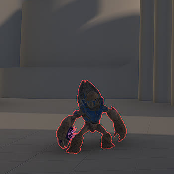
- Primary Weapon Type: Needler
- Secondary Weapon Type: -
- Grenade Type: Plasma Grenade
- Health per difficulty
  - Easy: 60
  - Normal: 60
  - Heroic: 80
  - Legendary: 100
- Shield per difficulty
  - Easy: 0
  - Normal: 0
  - Heroic: 0
  - Legendary: 0
- Species: Grunt
- Vehicle operation
  - Driver: Ghost
  - Passenger: Phantom
  - Gunner: M247 HMG Turret, Phantom, Plasma Cannon Turret, Shade Turret, Scrap Cannon Turret
- Notes: -

## Grunt Assault, Purple

- Primary Weapon Type: Needler
- Secondary Weapon Type: -
- Grenade Type: Plasma Grenade
- Health per difficulty
  - Easy: 105
  - Normal: 105
  - Heroic: 132.5
  - Legendary: 160
- Shield per difficulty
  - Easy: 0
  - Normal: 0
  - Heroic: 0
  - Legendary: 0
- Species: Grunt
- Vehicle operation
  - Driver: Ghost
  - Passenger: Phantom
  - Gunner: M247 HMG Turret, Phantom, Plasma Cannon Turret, Shade Turret, Scrap Cannon Turret
- Notes: -

## Grunt Assault, Red

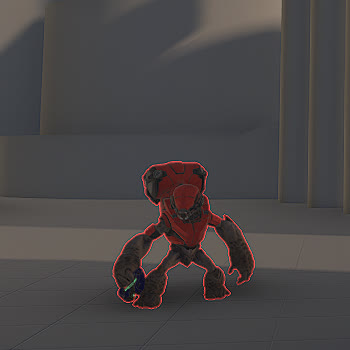
- Primary Weapon Type: Plasma Pistol
- Secondary Weapon Type: -
- Grenade Type: Plasma Grenade
- Health per difficulty
  - Easy: 105
  - Normal: 105
  - Heroic: 132.5
  - Legendary: 160
- Shield per difficulty
  - Easy: 0
  - Normal: 0
  - Heroic: 0
  - Legendary: 0
- Species: Grunt
- Vehicle operation
  - Driver: Ghost
  - Passenger: Phantom
  - Gunner: M247 HMG Turret, Phantom, Plasma Cannon Turret, Shade Turret, Scrap Cannon Turret
- Notes: -

## Grunt Ultra

- Primary Weapon Type: Disruptor
- Secondary Weapon Type: -
- Grenade Type: Plasma Grenade
- Health per difficulty
  - Easy: 135
  - Normal: 135
  - Heroic: 165
  - Legendary: 195
- Shield per difficulty
  - Easy: 0
  - Normal: 0
  - Heroic: 0
  - Legendary: 0
- Species: Grunt
- Vehicle operation
  - Driver: Ghost
  - Passenger: Phantom
  - Gunner: M247 HMG Turret, Phantom, Plasma Cannon Turret, Shade Turret, Scrap Cannon Turret
- Notes: -

## Boss Briglard

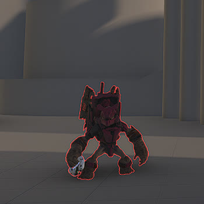
- Primary Weapon Type: Unbound Plasma Pistol
- Secondary Weapon Type: -
- Grenade Type: Plasma Grenade
- Health per difficulty
  - Easy: 175
  - Normal: 175
  - Heroic: 210
  - Legendary: 245
- Shield per difficulty
  - Easy: 0
  - Normal: 0
  - Heroic: 0
  - Legendary: 0
- Species: Grunt
- Vehicle operation
  - Driver: Ghost
  - Passenger: Phantom
  - Gunner: M247 HMG Turret, Phantom, Plasma Cannon Turret, Shade Turret, Scrap Cannon Turret
- Notes: Has a Ravager, CQS48 Bulldog and Shock Rifle on its back that can be picked up even when the AI is alive.

## Boss Bipbap

- Primary Weapon Type: Calcine Disruptor
- Secondary Weapon Type: -
- Grenade Type: Plasma Grenade
- Health per difficulty
  - Easy: 135
  - Normal: 135
  - Heroic: 165
  - Legendary: 195
- Shield per difficulty
  - Easy: 500
  - Normal: 500
  - Heroic: 650
  - Legendary: 800
- Species: Grunt
- Vehicle operation
  - Driver: Ghost
  - Passenger: Phantom
  - Gunner: M247 HMG Turret, Phantom, Plasma Cannon Turret, Shade Turret, Scrap Cannon Turret
- Notes: Only Grunt with a shield value.

## Jackal Freebooter

- Primary Weapon Type: Plasma Pistol
- Secondary Weapon Type: -
- Grenade Type: -
- Health per difficulty
  - Easy: 100
  - Normal: 100
  - Heroic: 120
  - Legendary: 140
- Shield per difficulty
  - Easy: 0
  - Normal: 0
  - Heroic: 0
  - Legendary: 0
- Species: Jackal
- Vehicle operation
  - Driver: -
  - Passenger: Phantom
  - Gunner: -
- Notes: Has a blue shield object in one hand that is separate from the AI health and shield values.

## Jackal Raider

- Primary Weapon Type: Needler
- Secondary Weapon Type: -
- Grenade Type: -
- Health per difficulty
  - Easy: 140
  - Normal: 140
  - Heroic: 175
  - Legendary: 210
- Shield per difficulty
  - Easy: 0
  - Normal: 0
  - Heroic: 0
  - Legendary: 0
- Species: Jackal
- Vehicle operation
  - Driver: -
  - Passenger: Phantom
  - Gunner: -
- Notes: Has a yellow shield object in one hand that is separate from the AI health and shield values and can absorb bullets.

## Jackal Sniper

- Primary Weapon Type: Stalker Rifle
- Secondary Weapon Type: -
- Grenade Type: -
- Health per difficulty
  - Easy: 60
  - Normal: 60
  - Heroic: 75
  - Legendary: 90
- Shield per difficulty
  - Easy: 0
  - Normal: 0
  - Heroic: 0
  - Legendary: 0
- Species: Jackal
- Vehicle operation
  - Driver: -
  - Passenger: Phantom
  - Gunner: -
- Notes: -

## Jackal Skirmisher

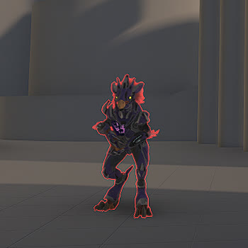
- Primary Weapon Type: Needler
- Secondary Weapon Type: -
- Grenade Type: -
- Health per difficulty
  - Easy: 160
  - Normal: 160
  - Heroic: 220
  - Legendary: 280
- Shield per difficulty
  - Easy: 0
  - Normal: 0
  - Heroic: 0
  - Legendary: 0
- Species: Jackal
- Vehicle operation
  - Driver: -
  - Passenger: Phantom
  - Gunner: -
- Notes: Has blue shields on its arms that are separate from the AI health and shield values and can absorb bullets.

## Boss Barroth

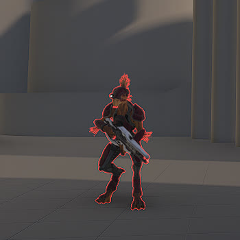
- Primary Weapon Type: Stalker Rifle Ultra
- Secondary Weapon Type: -
- Grenade Type: -
- Health per difficulty
  - Easy: 250
  - Normal: 250
  - Heroic: 300
  - Legendary: 350
- Shield per difficulty
  - Easy: 0
  - Normal: 0
  - Heroic: 0
  - Legendary: 0
- Species: Jackal
- Vehicle operation
  - Driver: -
  - Passenger: Phantom
  - Gunner: -
- Notes: -

## Boss Writh Kul

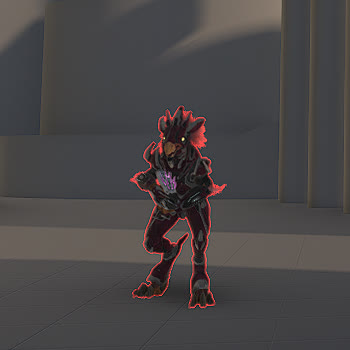
- Primary Weapon Type: Pinpoint Needler
- Secondary Weapon Type: -
- Grenade Type: -
- Health per difficulty
  - Easy: 450
  - Normal: 450
  - Heroic: 525
  - Legendary: 600
- Shield per difficulty
  - Easy: 0
  - Normal: 0
  - Heroic: 0
  - Legendary: 0
- Species: Jackal
- Vehicle operation
  - Driver: -
  - Passenger: Phantom
  - Gunner: -
- Notes: Has blue shields on its arms that are separate from the AI health and shield values and can absorb bullets.

## Skimmer

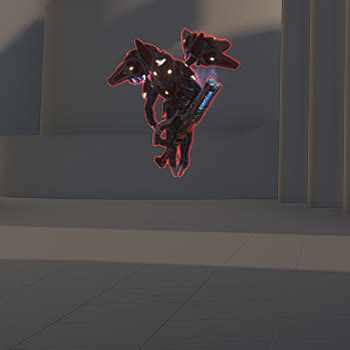
- Primary Weapon Type: Shock Rifle
- Secondary Weapon Type: -
- Grenade Type: Dynamo Grenade
- Health per difficulty
  - Easy: 100
  - Normal: 100
  - Heroic: 150
  - Legendary: 200
- Shield per difficulty
  - Easy: 0
  - Normal: 0
  - Heroic: 0
  - Legendary: 0
- Species: Skimmer
- Vehicle operation
  - Driver: -
  - Passenger: Phantom
  - Gunner: -
- Notes: -

## Skimmer Loyalist

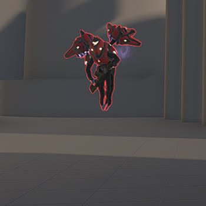
- Primary Weapon Type: VK78 Commando Rifle
- Secondary Weapon Type: -
- Grenade Type: Dynamo Grenade
- Health per difficulty
  - Easy: 100
  - Normal: 100
  - Heroic: 150
  - Legendary: 200
- Shield per difficulty
  - Easy: 0
  - Normal: 0
  - Heroic: 0
  - Legendary: 0
- Species: Skimmer
- Vehicle operation
  - Driver: -
  - Passenger: Phantom
  - Gunner: -
- Notes: -

## Skimmer Ultra

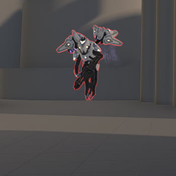
- Primary Weapon Type: M41 SPNKr
- Secondary Weapon Type: -
- Grenade Type: Dynamo Grenade
- Health per difficulty
  - Easy: 100
  - Normal: 100
  - Heroic: 150
  - Legendary: 200
- Shield per difficulty
  - Easy: 0
  - Normal: 0
  - Heroic: 0
  - Legendary: 0
- Species: Skimmer
- Vehicle operation
  - Driver: -
  - Passenger: Phantom
  - Gunner: -
- Notes: -

## Boss Skimmer Alpha

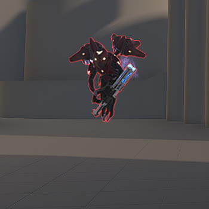
- Primary Weapon Type: Purging Shock Rifle
- Secondary Weapon Type: -
- Grenade Type: Dynamo Grenade
- Health per difficulty
  - Easy: 350
  - Normal: 350
  - Heroic: 425
  - Legendary: 500
- Shield per difficulty
  - Easy: 0
  - Normal: 0
  - Heroic: 0
  - Legendary: 0
- Species: Skimmer
- Vehicle operation
  - Driver: -
  - Passenger: Phantom
  - Gunner: -
- Notes: -

## Marine Survivor

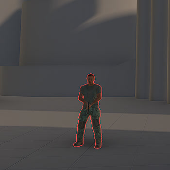
- Primary Weapon Type: Mk50 Sidekick
- Secondary Weapon Type: -
- Grenade Type: Frag Grenade
- Health per difficulty
  - Easy: 83
  - Normal: 83
  - Heroic: 144.5
  - Legendary: 206
- Shield per difficulty
  - Easy: 0
  - Normal: 0
  - Heroic: 0
  - Legendary: 0
- Species: Human
- Vehicle operation
  - Driver: -
  - Passenger: Gauss Hog, Gungoose, Mongoose, Razorback, Rocket Hog, Warthog
  - Gunner: Gauss Hog, M247 HMG Turret, Plasma Cannon Turret, Rocket Hog, Shade Turret, Scorpion, Scrap Cannon Turret, Warthog, Wraith
- Notes: Has multiple different models.

## Marine Assault

- Primary Weapon Type: MA40 Assault Rifle
- Secondary Weapon Type: -
- Grenade Type: Frag Grenade
- Health per difficulty
  - Easy: 110
  - Normal: 110
  - Heroic: 192.5
  - Legendary: 275
- Shield per difficulty
  - Easy: 0
  - Normal: 0
  - Heroic: 0
  - Legendary: 0
- Species: Human
- Vehicle operation
  - Driver: -
  - Passenger: Gauss Hog, Gungoose, Mongoose, Razorback, Rocket Hog, Warthog
  - Gunner: Gauss Hog, M247 HMG Turret, Plasma Cannon Turret, Rocket Hog, Shade Turret, Scorpion, Scrap Cannon Turret, Warthog, Wraith
- Notes: -

## Marine Scout

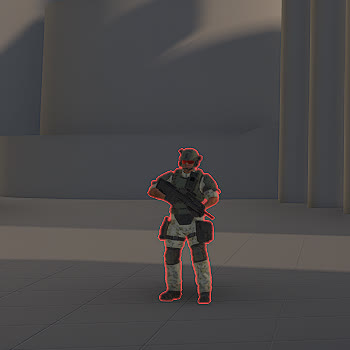
- Primary Weapon Type: BR75
- Secondary Weapon Type: -
- Grenade Type: Frag Grenade
- Health per difficulty
  - Easy: 110
  - Normal: 110
  - Heroic: 192.5
  - Legendary: 275
- Shield per difficulty
  - Easy: 0
  - Normal: 0
  - Heroic: 0
  - Legendary: 0
- Species: Human
- Vehicle operation
  - Driver: -
  - Passenger: Gauss Hog, Gungoose, Mongoose, Razorback, Rocket Hog, Warthog
  - Gunner: Gauss Hog, M247 HMG Turret, Plasma Cannon Turret, Rocket Hog, Shade Turret, Scorpion, Scrap Cannon Turret, Warthog, Wraith
- Notes: -

## Marine Sniper

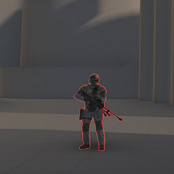
- Primary Weapon Type: S7 Sniper Rifle
- Secondary Weapon Type: Mk50 Sidekick
- Grenade Type: Frag Grenade
- Health per difficulty
  - Easy: 137
  - Normal: 137
  - Heroic: 240.5
  - Legendary: 344
- Shield per difficulty
  - Easy: 0
  - Normal: 0
  - Heroic: 0
  - Legendary: 0
- Species: Human
- Vehicle operation
  - Driver: -
  - Passenger: Gauss Hog, Gungoose, Mongoose, Razorback, Rocket Hog, Warthog
  - Gunner: Gauss Hog, M247 HMG Turret, Plasma Cannon Turret, Rocket Hog, Shade Turret, Scorpion, Scrap Cannon Turret, Warthog, Wraith
- Notes: -

## Marine Heavy

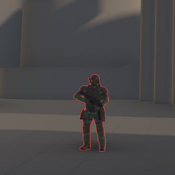
- Primary Weapon Type: CQS48 Bulldog
- Secondary Weapon Type: -
- Grenade Type: Frag Grenade
- Health per difficulty
  - Easy: 165
  - Normal: 165
  - Heroic: 277.5
  - Legendary: 412
- Shield per difficulty
  - Easy: 0
  - Normal: 0
  - Heroic: 0
  - Legendary: 0
- Species: Human
- Vehicle operation
  - Driver: -
  - Passenger: Gauss Hog, Gungoose, Mongoose, Razorback, Rocket Hog, Warthog
  - Gunner: Gauss Hog, M247 HMG Turret, Plasma Cannon Turret, Rocket Hog, Shade Turret, Scorpion, Scrap Cannon Turret, Warthog, Wraith
- Notes: -

## Marine Demolition

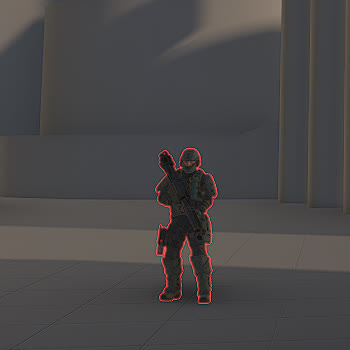
- Primary Weapon Type: M41 SPNKr
- Secondary Weapon Type: CQS48 Bulldog
- Grenade Type: Frag Grenade
- Health per difficulty
  - Easy: 165
  - Normal: 165
  - Heroic: 277.5
  - Legendary: 412
- Shield per difficulty
  - Easy: 0
  - Normal: 0
  - Heroic: 0
  - Legendary: 0
- Species: Human
- Vehicle operation
  - Driver: -
  - Passenger: Gauss Hog, Gungoose, Mongoose, Razorback, Rocket Hog, Warthog
  - Gunner: Gauss Hog, M247 HMG Turret, Plasma Cannon Turret, Rocket Hog, Shade Turret, Scorpion, Scrap Cannon Turret, Warthog, Wraith
- Notes: -

## Elite Mercenary

- Primary Weapon Type: Pulse Carbine
- Secondary Weapon Type: -
- Grenade Type: Plasma Grenade
- Health per difficulty
  - Easy: 110
  - Normal: 110
  - Heroic: 145
  - Legendary: 180
- Shield per difficulty
  - Easy: 160
  - Normal: 160
  - Heroic: 195
  - Legendary: 230
- Species: Elite
- Vehicle operation
  - Driver: Banshee, Ghost, Wraith
  - Passenger: Phantom
  - Gunner: M247 HMG Turret, Phantom, Plasma Cannon Turret, Shade Turret, Scrap Cannon Turret, Wraith
- Notes: Activates shield only after engaging a target.

## Elite Enforcer

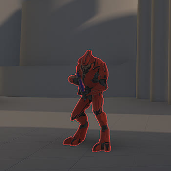
- Primary Weapon Type: Pulse Carbine
- Secondary Weapon Type: -
- Grenade Type: Plasma Grenade
- Health per difficulty
  - Easy: 180
  - Normal: 180
  - Heroic: 215
  - Legendary: 250
- Shield per difficulty
  - Easy: 320
  - Normal: 320
  - Heroic: 345
  - Legendary: 370
- Species: Elite
- Vehicle operation
  - Driver: Banshee, Ghost, Wraith
  - Passenger: Phantom
  - Gunner: M247 HMG Turret, Phantom, Plasma Cannon Turret, Shade Turret, Scrap Cannon Turret, Wraith
- Notes: Activates shield only after engaging a target.

## Elite Spec Ops

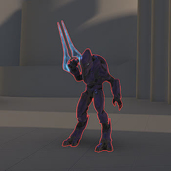
- Primary Weapon Type: Energy Sword
- Secondary Weapon Type: -
- Grenade Type: Plasma Grenade
- Health per difficulty
  - Easy: 180
  - Normal: 180
  - Heroic: 215
  - Legendary: 250
- Shield per difficulty
  - Easy: 320
  - Normal: 320
  - Heroic: 345
  - Legendary: 370
- Species: Elite
- Vehicle operation
  - Driver: Banshee, Ghost, Wraith
  - Passenger: Phantom
  - Gunner: M247 HMG Turret, Phantom, Plasma Cannon Turret, Shade Turret, Scrap Cannon Turret, Wraith
- Notes: Activates shield only after engaging a target. Has an Active Camouflage equipment that they may use during an engagement.

## Elite Ultra

- Primary Weapon Type: Heatwave
- Secondary Weapon Type: Energy Sword
- Grenade Type: Plasma Grenade
- Health per difficulty
  - Easy: 220
  - Normal: 220
  - Heroic: 255
  - Legendary: 290
- Shield per difficulty
  - Easy: 380
  - Normal: 380
  - Heroic: 315
  - Legendary: 450
- Species: Elite
- Vehicle operation
  - Driver: Banshee, Ghost, Wraith
  - Passenger: Phantom
  - Gunner: M247 HMG Turret, Phantom, Plasma Cannon Turret, Shade Turret, Scrap Cannon Turret, Wraith
- Notes: Activates shield only after engaging a target. Has an Active Camouflage equipment that they may use during an engagement.

## Elite Warlord

- Primary Weapon Type: Ravager
- Secondary Weapon Type: Energy Sword
- Grenade Type: Plasma Grenade
- Health per difficulty
  - Easy: 220
  - Normal: 220
  - Heroic: 255
  - Legendary: 290
- Shield per difficulty
  - Easy: 380
  - Normal: 380
  - Heroic: 315
  - Legendary: 450
- Species: Elite
- Vehicle operation
  - Driver: Banshee, Ghost, Wraith
  - Passenger: Phantom
  - Gunner: M247 HMG Turret, Phantom, Plasma Cannon Turret, Shade Turret, Scrap Cannon Turret, Wraith
- Notes: Activates shield only after engaging a target. Has an Active Camouflage equipment that they may use during an engagement.

## Boss Okro 'Vagaduun

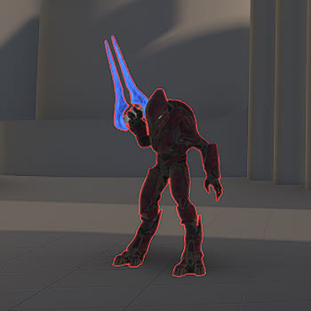
- Primary Weapon Type: Duelist Energy Sword
- Secondary Weapon Type: -
- Grenade Type: Plasma Grenade
- Health per difficulty
  - Easy: 150
  - Normal: 150
  - Heroic: 200
  - Legendary: 250
- Shield per difficulty
  - Easy: 500
  - Normal: 500
  - Heroic: 650
  - Legendary: 800
- Species: Elite
- Vehicle operation
  - Driver: Banshee, Ghost, Wraith
  - Passenger: Phantom
  - Gunner: M247 HMG Turret, Phantom, Plasma Cannon Turret, Shade Turret, Scrap Cannon Turret, Wraith
- Notes: Activates shield only after engaging a target. Has an Active Camouflage equipment that they may use during an engagement.

## Boss Inka 'Saham

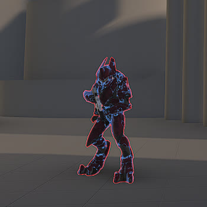
- Primary Weapon Type: Rapidfire Pulse Carbine
- Secondary Weapon Type: Energy Sword
- Grenade Type: Plasma Grenade
- Health per difficulty
  - Easy: 300
  - Normal: 300
  - Heroic: 325
  - Legendary: 350
- Shield per difficulty
  - Easy: 650
  - Normal: 650
  - Heroic: 750
  - Legendary: 850
- Species: Elite
- Vehicle operation
  - Driver: Banshee, Ghost, Wraith
  - Passenger: Phantom
  - Gunner: M247 HMG Turret, Plasma Cannon Turret, Shade Turret, Scrap Cannon Turret, Wraith
- Notes: Activates shield only after engaging a target. Has an Active Camouflage equipment that they may use during an engagement.

## Boss Ordo 'Mal

- Primary Weapon Type: Scatterbound Heatwave
- Secondary Weapon Type: Energy Sword
- Grenade Type: Plasma Grenade
- Health per difficulty
  - Easy: 350
  - Normal: 350
  - Heroic: 375
  - Legendary: 400
- Shield per difficulty
  - Easy: 700
  - Normal: 700
  - Heroic: 800
  - Legendary: 900
- Species: Elite
- Vehicle operation
  - Driver: Banshee, Ghost, Wraith
  - Passenger: Phantom
  - Gunner: M247 HMG Turret, Phantom, Plasma Cannon Turret, Shade Turret, Scrap Cannon Turret, Wraith
- Notes: Activates shield only after engaging a target. Has an Active Camouflage equipment that they may use during an engagement.

## Boss Thav 'Sebarim

- Primary Weapon Type: Arcane Sentinel Beam
- Secondary Weapon Type: -
- Grenade Type: Plasma Grenade
- Health per difficulty
  - Easy: 350
  - Normal: 350
  - Heroic: 375
  - Legendary: 400
- Shield per difficulty
  - Easy: 800
  - Normal: 800
  - Heroic: 900
  - Legendary: 1000
- Species: Elite
- Vehicle operation
  - Driver: Banshee, Ghost, Wraith
  - Passenger: Phantom
  - Gunner: M247 HMG Turret, Plasma Cannon Turret, Shade Turret, Scrap Cannon Turret, Wraith
- Notes: Activates shield only after engaging a target. Has an Active Camouflage equipment that they may use during an engagement.

## Boss Chak 'Lok

- Primary Weapon Type: Pulse Carbine
- Secondary Weapon Type: Energy Sword
- Grenade Type: Plasma Grenade
- Health per difficulty
  - Easy: 300
  - Normal: 300
  - Heroic: 350
  - Legendary: 400
- Shield per difficulty
  - Easy: 2500
  - Normal: 2500
  - Heroic: 3000
  - Legendary: 3500
- Species: Elite
- Vehicle operation
  - Driver: Banshee, Ghost, Wraith
  - Passenger: Phantom
  - Gunner: M247 HMG Turret, Phantom, Plasma Cannon Turret, Shade Turret, Scrap Cannon Turret, Wraith
- Notes: Activates shield only after engaging a target. Has an Active Camouflage equipment that they may use during an engagement.

## Boss Jega 'Rdomnai

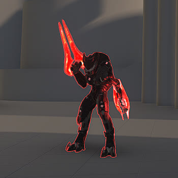
- Primary Weapon Type: Elite Bloodblade
- Secondary Weapon Type: -
- Grenade Type: Plasma Grenade
- Health per difficulty
  - Easy: 300
  - Normal: 300
  - Heroic: 350
  - Legendary: 400
- Shield per difficulty
  - Easy: 1400
  - Normal: 1400
  - Heroic: 1700
  - Legendary: 2000
- Species: Elite
- Vehicle operation
  - Driver: Banshee, Ghost, Wraith
  - Passenger: Phantom
  - Gunner: M247 HMG Turret, Plasma Cannon Turret, Shade Turret, Scrap Cannon Turret, Wraith
- Notes: Activates shield only after engaging a target. Has an Active Camouflage equipment that they may use during an engagement.

## Hunter

- Primary Weapon Type: Hunter Primary
- Secondary Weapon Type: Hunter Secondary
- Grenade Type: -
- Health per difficulty
  - Easy: 450
  - Normal: 450
  - Heroic: 550
  - Legendary: 650
- Shield per difficulty
  - Easy: 0
  - Normal: 0
  - Heroic: 0
  - Legendary: 0
- Species: Hunter
- Vehicle operation
  - Driver: -
  - Passenger: Phantom
  - Gunner: -
- Notes: -

## Hunter, Banished

- Primary Weapon Type: Banished Hunter Primary
- Secondary Weapon Type: Banished Hunter Secondary
- Grenade Type: -
- Health per difficulty
  - Easy: 650
  - Normal: 650
  - Heroic: 750
  - Legendary: 850
- Shield per difficulty
  - Easy: 0
  - Normal: 0
  - Heroic: 0
  - Legendary: 0
- Species: Hunter
- Vehicle operation
  - Driver: -
  - Passenger: Phantom
  - Gunner: -
- Notes: -

## Boss Myriad

- Primary Weapon Type: Banished Hunter Primary
- Secondary Weapon Type: Banished Hunter Secondary
- Grenade Type: -
- Health per difficulty
  - Easy: 1000
  - Normal: 1000
  - Heroic: 1100
  - Legendary: 1200
- Shield per difficulty
  - Easy: 0
  - Normal: 0
  - Heroic: 0
  - Legendary: 0
- Species: Hunter
- Vehicle operation
  - Driver: -
  - Passenger: Phantom
  - Gunner: -
- Notes: -

## Brute Minor

- Primary Weapon Type: Mangler
- Secondary Weapon Type: Brute Fists
- Grenade Type: Spike Grenade
- Health per difficulty
  - Easy: 140
  - Normal: 140
  - Heroic: 170
  - Legendary: 200
- Shield per difficulty
  - Easy: 0
  - Normal: 0
  - Heroic: 0
  - Legendary: 0
- Species: Brute
- Vehicle operation
  - Driver: Banshee, Brute Chopper, Chopper Boss, Ghost, Wraith
  - Passenger: Phantom
  - Gunner: M247 HMG Turret, Plasma Cannon Turret, Shade Turret, Scrap Cannon Turret, Wraith
- Notes: Has armor pieces that can be shot off to deal more damage to the unarmored areas.

## Brute Sniper

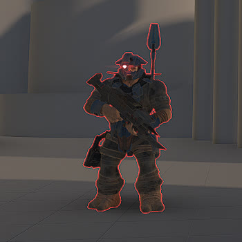
- Primary Weapon Type: Skewer
- Secondary Weapon Type: Mangler
- Grenade Type: Spike Grenade
- Health per difficulty
  - Easy: 150
  - Normal: 150
  - Heroic: 175
  - Legendary: 200
- Shield per difficulty
  - Easy: 0
  - Normal: 0
  - Heroic: 0
  - Legendary: 0
- Species: Brute
- Vehicle operation
  - Driver: Banshee, Brute Chopper, Chopper Boss, Ghost, Wraith
  - Passenger: Phantom
  - Gunner: M247 HMG Turret, Phantom, Plasma Cannon Turret, Shade Turret, Scrap Cannon Turret, Wraith
- Notes: Has armor pieces that can be shot off to deal more damage to the unarmored areas.

## Brute Sniper, Heavy

- Primary Weapon Type: Shock Rifle
- Secondary Weapon Type: Disruptor
- Grenade Type: Spike Grenade
- Health per difficulty
  - Easy: 150
  - Normal: 150
  - Heroic: 175
  - Legendary: 200
- Shield per difficulty
  - Easy: 0
  - Normal: 0
  - Heroic: 0
  - Legendary: 0
- Species: Brute
- Vehicle operation
  - Driver: Banshee, Brute Chopper, Chopper Boss, Ghost, Wraith
  - Passenger: Phantom
  - Gunner: M247 HMG Turret, Phantom, Plasma Cannon Turret, Shade Turret, Scrap Cannon Turret, Wraith
- Notes: Has armor pieces that can be shot off to deal more damage to the unarmored areas.

## Brute Commando

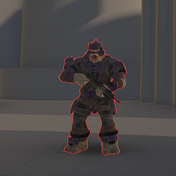
- Primary Weapon Type: VK78 Commando Rifle
- Secondary Weapon Type: -
- Grenade Type: Spike Grenade
- Health per difficulty
  - Easy: 175
  - Normal: 175
  - Heroic: 212.5
  - Legendary: 250
- Shield per difficulty
  - Easy: 0
  - Normal: 0
  - Heroic: 0
  - Legendary: 0
- Species: Brute
- Vehicle operation
  - Driver: Banshee, Brute Chopper, Chopper Boss, Ghost, Wraith
  - Passenger: Phantom
  - Gunner: M247 HMG Turret, Phantom, Plasma Cannon Turret, Shade Turret, Scrap Cannon Turret, Wraith
- Notes: Has armor pieces that can be shot off to deal more damage to the unarmored areas.

## Brute Commando, Chosen

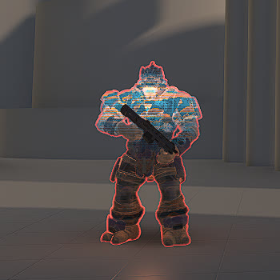
- Primary Weapon Type: CQS48 Bulldog
- Secondary Weapon Type: -
- Grenade Type: Spike Grenade
- Health per difficulty
  - Easy: 140
  - Normal: 140
  - Heroic: 170
  - Legendary: 200
- Shield per difficulty
  - Easy: 90
  - Normal: 90
  - Heroic: 90
  - Legendary: 90
- Species: Brute
- Vehicle operation
  - Driver: Banshee, Brute Chopper, Chopper Boss, Ghost, Wraith
  - Passenger: Phantom
  - Gunner: M247 HMG Turret, Phantom, Plasma Cannon Turret, Shade Turret, Scrap Cannon Turret, Wraith
- Notes: Has armor pieces that can be shot off to deal more damage to the unarmored areas.

## Brute Warrior

- Primary Weapon Type: CQS48 Bulldog
- Secondary Weapon Type: -
- Grenade Type: Spike Grenade
- Health per difficulty
  - Easy: 196
  - Normal: 196
  - Heroic: 238
  - Legendary: 280
- Shield per difficulty
  - Easy: 0
  - Normal: 0
  - Heroic: 0
  - Legendary: 0
- Species: Brute
- Vehicle operation
  - Driver: Banshee, Brute Chopper, Chopper Boss, Ghost, Wraith
  - Passenger: Phantom
  - Gunner: M247 HMG Turret, Phantom, Plasma Cannon Turret, Shade Turret, Scrap Cannon Turret, Wraith
- Notes: Has armor pieces that can be shot off to deal more damage to the unarmored areas.

## Brute Warrior, Chosen

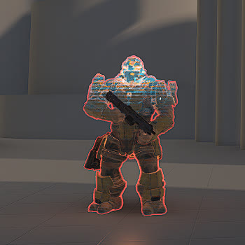
- Primary Weapon Type: CQS48 Bulldog
- Secondary Weapon Type: Mangler
- Grenade Type: Spike Grenade
- Health per difficulty
  - Easy: 140
  - Normal: 140
  - Heroic: 170
  - Legendary: 200
- Shield per difficulty
  - Easy: 120
  - Normal: 120
  - Heroic: 150
  - Legendary: 180
- Species: Brute
- Vehicle operation
  - Driver: Banshee, Brute Chopper, Chopper Boss, Ghost, Wraith
  - Passenger: Phantom
  - Gunner: M247 HMG Turret, Phantom,   Plasma Cannon Turret, Shade Turret, Scrap Cannon Turret, Wraith
- Notes: Has armor pieces that can be shot off to deal more damage to the unarmored areas.

## Brute Berserker

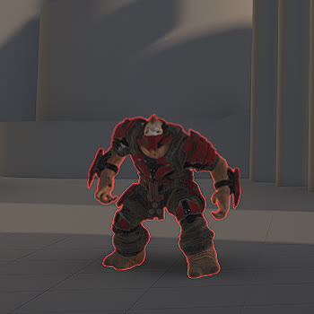
- Primary Weapon Type: Brute Fists
- Secondary Weapon Type: -
- Grenade Type: Dynamo Grenade
- Health per difficulty
  - Easy: 250
  - Normal: 250
  - Heroic: 300
  - Legendary: 350
- Shield per difficulty
  - Easy: 0
  - Normal: 0
  - Heroic: 0
  - Legendary: 0
- Species: Brute
- Vehicle operation
  - Driver: Brute Chopper, Chopper Boss, Ghost, Wraith
  - Passenger: -
  - Gunner: M247 HMG Turret, Phantom, Plasma Cannon Turret, Shade Turret, Scrap Cannon Turret, Wraith
- Notes: Has armor pieces that can be shot off to deal more damage to the unarmored areas.

## Brute Berserker, Chosen

- Primary Weapon Type: Brute Fists
- Secondary Weapon Type: -
- Grenade Type: Dynamo Grenade
- Health per difficulty
  - Easy: 250
  - Normal: 250
  - Heroic: 300
  - Legendary: 350
- Shield per difficulty
  - Easy: 120
  - Normal: 120
  - Heroic: 120
  - Legendary: 120
- Species: Brute
- Vehicle operation
  - Driver: Brute Chopper, Chopper Boss, Ghost, Wraith
  - Passenger: -
  - Gunner: M247 HMG Turret, Phantom, Plasma Cannon Turret, Shade Turret, Scrap Cannon Turret, Wraith
- Notes: Has armor pieces that can be shot off to deal more damage to the unarmored areas.

## Brute Captain

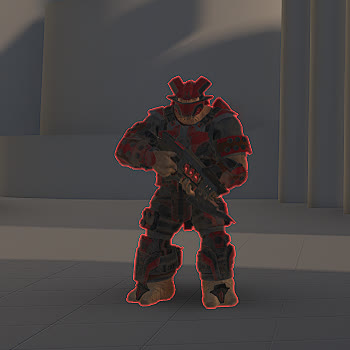
- Primary Weapon Type: Ravager
- Secondary Weapon Type: -
- Grenade Type: Spike Grenade
- Health per difficulty
  - Easy: 360
  - Normal: 360
  - Heroic: 392.5
  - Legendary: 425
- Shield per difficulty
  - Easy: 0
  - Normal: 0
  - Heroic: 0
  - Legendary: 0
- Species: Brute
- Vehicle operation
  - Driver: Banshee, Brute Chopper, Chopper Boss, Ghost, Wraith
  - Passenger: Phantom
  - Gunner: M247 HMG Turret, Phantom, Plasma Cannon Turret, Shade Turret, Scrap Cannon Turret, Wraith
- Notes: Has armor pieces that can be shot off to deal more damage to the unarmored areas. Has a jetpack that they can use to jump any length or height nav jump hint.

## Brute Captain, Chosen

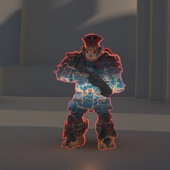
- Primary Weapon Type: MLRS-2 Hydra
- Secondary Weapon Type: -
- Grenade Type: Spike Grenade
- Health per difficulty
  - Easy: 400
  - Normal: 400
  - Heroic: 435
  - Legendary: 470
- Shield per difficulty
  - Easy: 120
  - Normal: 120
  - Heroic: 150
  - Legendary: 180
- Species: Brute
- Vehicle operation
  - Driver: Banshee, Brute Chopper, Chopper Boss, Ghost, Wraith
  - Passenger: Phantom
  - Gunner: M247 HMG Turret, Phantom, Plasma Cannon Turret, Shade Turret, Scrap Cannon Turret, Wraith
- Notes: Has armor pieces that can be shot off to deal more damage to the unarmored areas. Has a jetpack that they can use to jump any length or height nav jump hint.

## Brute Warlord

- Primary Weapon Type: Heatwave
- Secondary Weapon Type: -
- Grenade Type: Spike Grenade
- Health per difficulty
  - Easy: 400
  - Normal: 400
  - Heroic: 435
  - Legendary: 470
- Shield per difficulty
  - Easy: 120
  - Normal: 120
  - Heroic: 150
  - Legendary: 180
- Species: Brute
- Vehicle operation
  - Driver: Banshee, Brute Chopper, Chopper Boss, Ghost, Wraith
  - Passenger: Phantom
  - Gunner: M247 HMG Turret, Phantom, Plasma Cannon Turret, Shade Turret, Scrap Cannon Turret, Wraith
- Notes: Has armor pieces that can be shot off to deal more damage to the unarmored areas. Has a jetpack that they can use to jump any length or height nav jump hint.

## Brute Chieftain

- Primary Weapon Type: Gravity Hammer
- Secondary Weapon Type: -
- Grenade Type: Spike Grenade
- Health per difficulty
  - Easy: 780
  - Normal: 780
  - Heroic: 950
  - Legendary: 1120
- Shield per difficulty
  - Easy: 0
  - Normal: 0
  - Heroic: 0
  - Legendary: 0
- Species: Brute
- Vehicle operation
  - Driver: Brute Chopper, Chopper Boss
  - Passenger: Phantom
  - Gunner: -
- Notes: Has armor pieces that can be shot off to deal more damage to the unarmored areas. Their melee attack deals an EMP shock to nearby vehicles. Can not wield any other weapon than their default.

## Brute Chieftain, Chosen

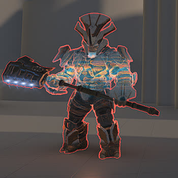
- Primary Weapon Type: Gravity Hammer
- Secondary Weapon Type: -
- Grenade Type: Spike Grenade
- Health per difficulty
  - Easy: 1120
  - Normal: 1120
  - Heroic: 1345
  - Legendary: 1570
- Shield per difficulty
  - Easy: 200
  - Normal: 200
  - Heroic: 275
  - Legendary: 350
- Species: Brute
- Vehicle operation
  - Driver: Brute Chopper, Chopper Boss
  - Passenger: Phantom
  - Gunner: -
- Notes: Has armor pieces that can be shot off to deal more damage to the unarmored areas. Their melee attack deals an EMP shock to nearby vehicles. Can not wield any other weapon than their default.

## Brute Chieftain Turret

- Primary Weapon Type: Plasma Cannon
- Secondary Weapon Type: -
- Grenade Type: Spike Grenade
- Health per difficulty
  - Easy: 780
  - Normal: 780
  - Heroic: 950
  - Legendary: 1120
- Shield per difficulty
  - Easy: 0
  - Normal: 0
  - Heroic: 0
  - Legendary: 0
- Species: Brute
- Vehicle operation
  - Driver: Brute Chopper, Chopper Boss
  - Passenger: Phantom
  - Gunner: -
- Notes: Has armor pieces that can be shot off to deal more damage to the unarmored areas. Can not wield any other weapon than their default.

## Brute Chieftain Turret, Chosen

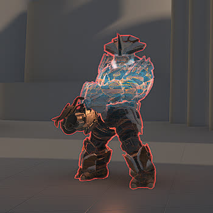
- Primary Weapon Type: Brute Scrap Cannon (Scrap Cannon variant)
- Secondary Weapon Type: -
- Grenade Type: Spike Grenade
- Health per difficulty
  - Easy: 1120
  - Normal: 1120
  - Heroic: 1345
  - Legendary: 1570
- Shield per difficulty
  - Easy: 200
  - Normal: 200
  - Heroic: 275
  - Legendary: 350
- Species: Brute
- Vehicle operation
  - Driver: Brute Chopper, Chopper Boss
  - Passenger: Phantom
  - Gunner: -
- Notes: Has armor pieces that can be shot off to deal more damage to the unarmored areas. Can not wield any other weapon than their default. Drops a regular Scrap Cannon on death.

## Boss Arthoc

- Primary Weapon Type: Ravager Rebound
- Secondary Weapon Type: -
- Grenade Type: Spike Grenade
- Health per difficulty
  - Easy: 895
  - Normal: 895
  - Heroic: 1008
  - Legendary: 1120
- Shield per difficulty
  - Easy: 300
  - Normal: 300
  - Heroic: 375
  - Legendary: 450
- Species: Brute
- Vehicle operation
  - Driver: Banshee, Brute Chopper, Chopper Boss, Ghost, Wraith
  - Passenger: Phantom
  - Gunner: M247 HMG Turret, Phantom, Plasma Cannon Turret, Shade Turret, Scrap Cannon Turret, Wraith
- Notes: Has armor pieces that can be shot off to deal more damage to the unarmored areas. Has a jetpack that they can use to jump any length or height nav jump hint.

## Boss Balkarus

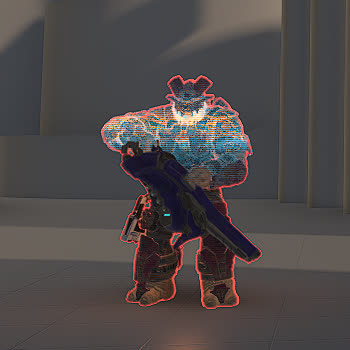
- Primary Weapon Type: Plasma Cannon
- Secondary Weapon Type: Riven Mangler
- Grenade Type: Spike Grenade
- Health per difficulty
  - Easy: 895
  - Normal: 895
  - Heroic: 1008
  - Legendary: 1120
- Shield per difficulty
  - Easy: 300
  - Normal: 300
  - Heroic: 375
  - Legendary: 450
- Species: Brute
- Vehicle operation
  - Driver: Banshee, Brute Chopper, Chopper Boss, Ghost, Wraith
  - Passenger: Phantom
  - Gunner: M247 HMG Turret, Phantom, Plasma Cannon Turret, Shade Turret, Scrap Cannon Turret, Wraith
- Notes: Has armor pieces that can be shot off to deal more damage to the unarmored areas. Has a jetpack that they can use to jump any length or height nav jump hint.

## Boss Zeretus

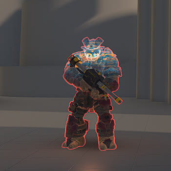
- Primary Weapon Type: M41 Tracker
- Secondary Weapon Type: -
- Grenade Type: Spike Grenade
- Health per difficulty
  - Easy: 895
  - Normal: 895
  - Heroic: 1008
  - Legendary: 1120
- Shield per difficulty
  - Easy: 300
  - Normal: 300
  - Heroic: 375
  - Legendary: 450
- Species: Brute
- Vehicle operation
  - Driver: Banshee, Brute Chopper, Chopper Boss, Ghost, Wraith
  - Passenger: Phantom
  - Gunner: M247 HMG Turret, Phantom, Plasma Cannon Turret, Shade Turret, Scrap Cannon Turret, Wraith
- Notes: Has armor pieces that can be shot off to deal more damage to the unarmored areas. Has a jetpack that they can use to jump any length or height nav jump hint.

## Boss Ik'novus

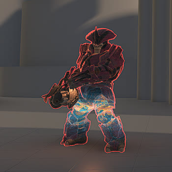
- Primary Weapon Type: Brute Scrap Cannon (Scrap Cannon variant)
- Secondary Weapon Type: -
- Grenade Type: -
- Health per difficulty
  - Easy: 1230
  - Normal: 1230
  - Heroic: 1400
  - Legendary: 1570
- Shield per difficulty
  - Easy: 300
  - Normal: 300
  - Heroic: 375
  - Legendary: 450
- Species: Brute
- Vehicle operation
  - Driver: Brute Chopper, Chopper Boss
  - Passenger: Phantom
  - Gunner: -
- Notes: Has armor pieces that can be shot off to deal more damage to the unarmored areas.

## Boss En'geddon

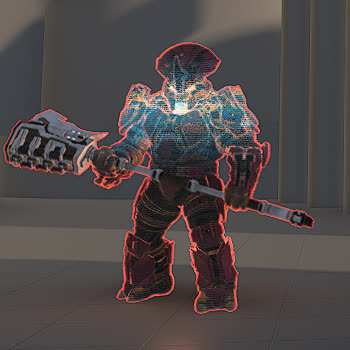
- Primary Weapon Type: Rushdown Hammer
- Secondary Weapon Type: -
- Grenade Type: Spike Grenade
- Health per difficulty
  - Easy: 1230
  - Normal: 1230
  - Heroic: 1400
  - Legendary: 1570
- Shield per difficulty
  - Easy: 400
  - Normal: 400
  - Heroic: 500
  - Legendary: 600
- Species: Brute
- Vehicle operation
  - Driver: Brute Chopper, Chopper Boss
  - Passenger: Phantom
  - Gunner: -
- Notes: Has armor pieces that can be shot off to deal more damage to the unarmored areas.

## Boss Tremonius

- Primary Weapon Type: MLRS-2 Hydra
- Secondary Weapon Type: CQS48 Bulldog
- Grenade Type: Frag Grenade
- Health per difficulty
  - Easy: 1000
  - Normal: 1000
  - Heroic: 1175
  - Legendary: 1350
- Shield per difficulty
  - Easy: 450
  - Normal: 450
  - Heroic: 575
  - Legendary: 700
- Species: Brute
- Vehicle operation
  - Driver: Banshee, Brute Chopper, Chopper Boss, Ghost, Wraith
  - Passenger: Phantom
  - Gunner: M247 HMG Turret, Phantom, Plasma Cannon Turret, Shade Turret, Scrap Cannon Turret, Wraith
- Notes: Has armor pieces that can be shot off to deal more damage to the unarmored areas. Has a jetpack that they can use to jump any length or height nav jump hint.

## Boss Hyperius

- Primary Weapon Type: Ravager
- Secondary Weapon Type: S7 Sniper Rifle
- Grenade Type: Spike Grenade
- Health per difficulty
  - Easy: 1400
  - Normal: 1400
  - Heroic: 1512
  - Legendary: 1624
- Shield per difficulty
  - Easy: 300
  - Normal: 300
  - Heroic: 400
  - Legendary: 500
- Species: Brute
- Vehicle operation
  - Driver: Banshee, Brute Chopper, Chopper Boss, Ghost, Wraith
  - Passenger: Phantom
  - Gunner: M247 HMG Turret, Phantom, Plasma Cannon Turret, Shade Turret, Scrap Cannon Turret, Wraith
- Notes: Has armor pieces that can be shot off to deal more damage to the unarmored areas. Has a jetpack that they can use to jump any length or height nav jump hint.

## Boss Tovarus

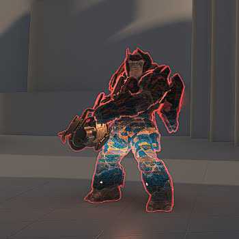
- Primary Weapon Type: Brute Scrap Cannon (Scrap Cannon variant)
- Secondary Weapon Type: -
- Grenade Type: Spike Grenade
- Health per difficulty
  - Easy: 1600
  - Normal: 1600
  - Heroic: 1900
  - Legendary: 2200
- Shield per difficulty
  - Easy: 400
  - Normal: 400
  - Heroic: 500
  - Legendary: 600
- Species: Brute
- Vehicle operation
  - Driver: Brute Chopper, Chopper Boss
  - Passenger: Phantom
  - Gunner: -
- Notes: Has armor pieces that can be shot off to deal more damage to the unarmored areas. Has a jetpack that they can use to jump any length or height nav jump hint.

## Boss Bassus

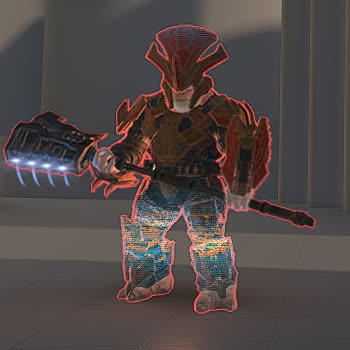
- Primary Weapon Type: Gravity Hammer
- Secondary Weapon Type: -
- Grenade Type: Plasma Grenade
- Health per difficulty
  - Easy: 1790
  - Normal: 1790
  - Heroic: 2125
  - Legendary: 2640
- Shield per difficulty
  - Easy: 425
  - Normal: 425
  - Heroic: 588
  - Legendary: 750
- Species: Brute
- Vehicle operation
  - Driver: Brute Chopper, Chopper Boss
  - Passenger: Phantom
  - Gunner: -
- Notes: Has armor pieces that can be shot off to deal more damage to the unarmored areas. Their melee attack deals an EMP shock to nearby vehicles. Can not wield any other weapon than their default.

## Boss Escharum

- Primary Weapon Type: Brute Scrap Cannon (Scrap Cannon variant)
- Secondary Weapon Type: Diminisher of Hope
- Grenade Type: Spike Grenade
- Health per difficulty
  - Easy: 7000
  - Normal: 7000
  - Heroic: 8000
  - Legendary: 9000
- Shield per difficulty
  - Easy: 800
  - Normal: 800
  - Heroic: 800
  - Legendary: 800
- Species: Brute
- Vehicle operation
  - Driver: Brute Chopper, Chopper Boss
  - Passenger: Phantom
  - Gunner: -
- Notes: Has armor pieces that can be shot off to deal more damage to the unarmored areas. Has a red bubble shield that needs to be destroyed 5 times before he swaps to the Diminisher of Hope and doesn't gain back the shield anymore.

## Boss Adjutant Resolution, Silver

- Primary Weapon Type: Silver Sentry Primary (Pulse Carbine variant)
- Secondary Weapon Type: Silver Sentry Secondary (Cindershot variant)
- Tertiary Weapon Type: Sentry Tertiary (Sentinel Beam variant)
- Grenade Type: -
- Health per difficulty
  - Easy: 2640
  - Normal: 2640
  - Heroic: 2640
  - Legendary: 2640
- Shield per difficulty
  - Easy: 0
  - Normal: 0
  - Heroic: 0
  - Legendary: 0
- Species: Sentinel
- Vehicle operation
  - Driver: -
  - Passenger: -
  - Gunner: -
- Notes: Has different stages of offense. The outer arms must be shot out before being able to kill it.

## Boss Adjutant Resolution, Gold

- Primary Weapon Type: Gold Sentry Primary (Scrap Cannon variant)
- Secondary Weapon Type: Gold Sentry Secondary (M41 SPNKr variant)
- Tertiary Weapon Type: Sentry Tertiary (Sentinel Beam variant)
- Grenade Type: -
- Health per difficulty
  - Easy: 3170
  - Normal: 3170
  - Heroic: 3170
  - Legendary: 3170
- Shield per difficulty
  - Easy: 0
  - Normal: 0
  - Heroic: 0
  - Legendary: 0
- Species: Sentinel
- Vehicle operation
  - Driver: -
  - Passenger: -
  - Gunner: -
- Notes: Has different stages of offense. The outer arms must be shot out before being able to kill it.

## Boss Harbinger

- Primary Weapon Type: Harbinger Primary (Unique)
- Secondary Weapon Type: -
- Grenade Type: -
- Health per difficulty
  - Easy: 200
  - Normal: 200
  - Heroic: 200
  - Legendary: 200
- Shield per difficulty
  - Easy: 800
  - Normal: 800
  - Heroic: 1025
  - Legendary: 1250
- Species: ?
- Vehicle operation
  - Driver: -
  - Passenger: -
  - Gunner: -
- Notes: Shoots blue orbs that charge up mid-air and track to the nearest enemy. Impacts of the shots leave a lingering damage effect. The AI teleports around when engaging an enemy. Has 4 stages of damaging shield, then health; when health is damaged enough, they teleport to the position of their AI Spawner.

## Acknowledgements

Major research credit to cr0n14 (discord) for their [halo_infinite_unit_stats](https://docs.google.com/spreadsheets/d/e/2PACX-1vTZqdsTmPgdPCZT5IYoqvJrqbmKBLXzecmx3YP_aIejHypTw-Cxgwg9uwr_I7sImhhYVQq-agEt7xZO/pubhtml#) spreadsheet!